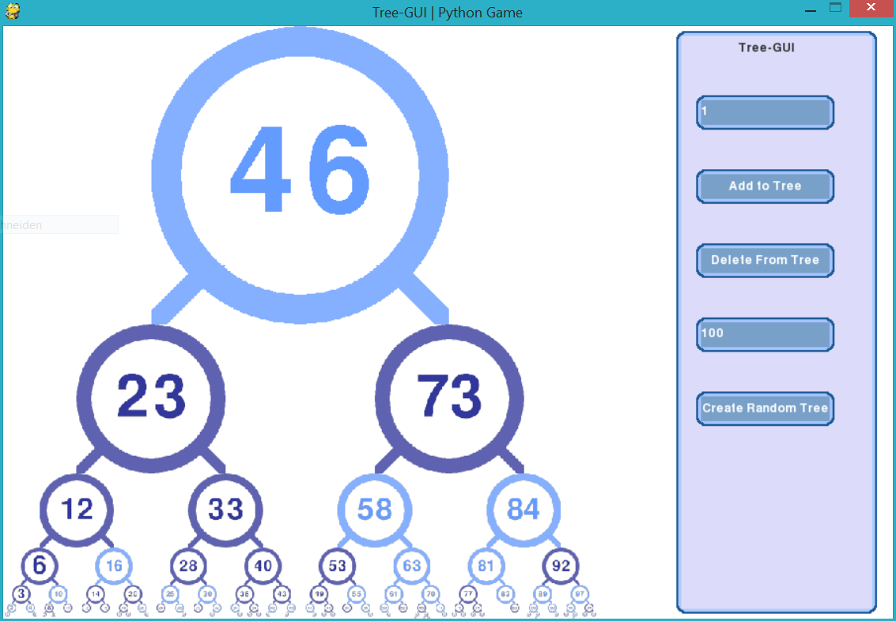

# PyGVisuals
A collection of classes to create GUI's and more based purely on pygame (https://www.pygame.org/news).
(Works with both pygame 1.9.6 and pygame 2.)

_This is a byproduct of a larger, currently unactive and incomplete [project](https://github.com/AlinaGri/CoolesSpiel).
The classes now in PyGVisuals were developed by Impelon and kjkriegel._

___Note: Impelon currently maintains this project___

The project is (hopefully) well documented and includes most basic widgets.

## Helpful Links

- [Homepage](https://impelon.github.io/PyGVisuals/)
- [Documentation](https://impelon.github.io/PyGVisuals/)
- [GitHub](https://github.com/Impelon/PyGVisuals)
- Also check out [Pygame GUI](https://github.com/MyreMylar/pygame_gui) for a more modern and extensive GUI Library for pygame

## Help Wanted
Suggestions (& requests), bug-reports and contributions are welcome. If you have any ideas how to help me with this please comment on the respective issue.

I would be happy to see you use the contents of this repository. You are encouraged to open up a page on the Wiki showing how you use PyGVisuals in your projects.

## Screenshots/Examples

_A screenshot taken from the bintree-gui_

## Usage
According to the [BSD-Licence](LICENSE) PyGVisuals is using, you can use the contens of this repository to your liking as long as you follow the licence's terms and conditions. If you want to include PyGVisuals or parts of it in your own project, include the files you need into your project's package (be sure to also include the [license](LICENSE)). You can also install pygvisuals via pip from source. See down below.

## Install

Currently to install this to your python-modules you need to download the project's sourcecode manually. You can download it from GitHub or via git.

1. Download source and change directory into source: `git clone https://github.com/Impelon/PyGVisuals.git && cd PyGVisuals`
2. Install from current directory via pip: `pip install -e .`

## Epiloge

If you need help with using PyGVisuals, you can open an issue and I will try to help.
Also if you need any other features, you can also open an issue and add the label 'request'. I will work on new features that I thing are worth adding.

Currently, because PyGVisuals is not actively used anywhere (I do not even use it myself, because I do not work on any python projects atm.), I do not have much motivation to add new features without any reasons.

__PyGVisuals requires [pygame](https://www.pygame.org/news) and obviously [python](https://www.python.org/) to work__
